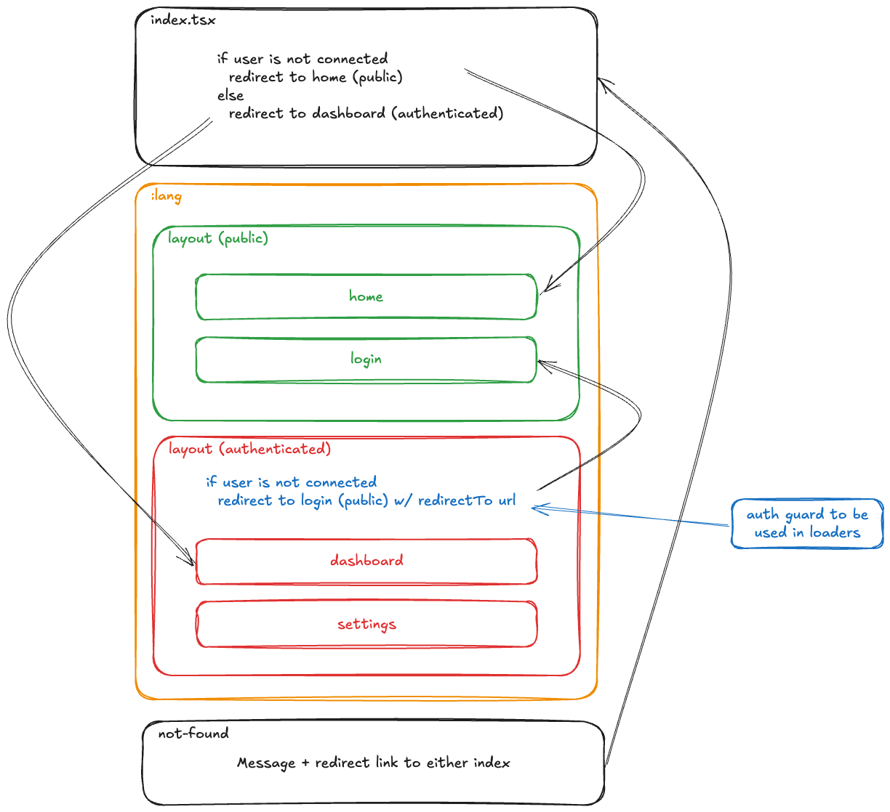

# Project Routing and Auth Guard Overview



## Routing

This project uses React Router v7 **as a framework** to manage the application's routing. The routes are defined in the `src/routes.ts` file and are organized into public and authenticated routes.

### Public Routes

Public routes are accessible without authentication and are defined under the `src/routes/public-routes` directory. These include:

- **Home**: Accessible at `/en|fr/home`, defined in `src/routes/public-routes/home/home.tsx`.
- **Login**: Accessible at `/en|fr/login`, defined in `src/routes/public-routes/login/login.tsx`.

The layout for public routes is defined in `src/routes/public-routes/layout.tsx`.

### Authenticated Routes

Authenticated routes require the user to be logged in and are defined under the `src/routes/authenticated-routes` directory. These include:

- **Dashboard**: Accessible at `/en|fr/dashboard`, defined in `src/routes/authenticated-routes/dashboard/dashboard.tsx`.
- **Settings**: Accessible at `/en|fr/settings`, defined in `src/routes/authenticated-routes/settings/dashboard.tsx`.

The layout for authenticated routes is defined in `src/routes/authenticated-routes/layout.tsx`.

### Route Configuration

The routing configuration is defined in `src/routes.ts` using the `@react-router/dev/routes` package. The routes are localized (but keep in mind, the language in the url is not a :param).

### Route Internationalization

Each route is defined inside a `route.ts` file (for example, `src/routes/authenticated-routes/dashboard/route.ts`).  
These files have the localized paths and a path to the route module needed by react router.

Note that the path to the locales in these files is different (`#assets` instead of the expcted `@assets`).  
When using react router as a framework, the routes are built via a vite.js plugin, running in node.js (not in the browser).  
The alias here is different than the one define in the tsconfig file. This alias comes from the `imports` property in the package.json file.

## Auth Guard

The auth guard ensures that only authenticated users can access certain routes. It is implemented in the `src/routes/auth-guard.ts` file.

### How It Works

1. **Check User Authentication**: The `clientLoaderAuthGuard` function checks if the user is authenticated by accessing the user state from the `useUserStore`.

2. **Redirect if Not Authenticated**: If the user is not authenticated, the function redirects them to the login page. If `includeRedirectPath` is true, the current path is included as a redirect parameter so the user can be redirected back after logging in.

3. **Resolve if Authenticated**: If the user is authenticated, the function resolves, allowing access to the protected route.

### Usage

In Remix.js or React Router v7, auth guards are implemented in the client loaders rather than as component-based guards. This ensures that the authentication check happens before the component is rendered, providing a smoother user experience.

The `clientLoaderAuthGuard` function is used in the client loaders of authenticated routes to enforce authentication. For example:

```typescript
// src/routes/authenticated-routes/layout.tsx
export const clientLoader = async ({
  params: _params,
}: ClientLoaderFunctionArgs) => {
  await clientLoaderAuthGuard(false);
  return {};
};
```

This ensures that the dashboard route is only accessible to authenticated users.

At the moment, react rouvet v7 does not support middlewares (it is planned though). You have a couple of options as to **where** to use the `clientLoaderAuthGuard`:

- You can add it to the loader functions inside each route (this could be useful for more granular, role based access rules)
- You can add it to the loader of a common layout (for example, `authenticated-routes/layout.tsx`), mimicking the behavior of component based auth guards (this could be useful for higher level access, like "is the user logged in?")
